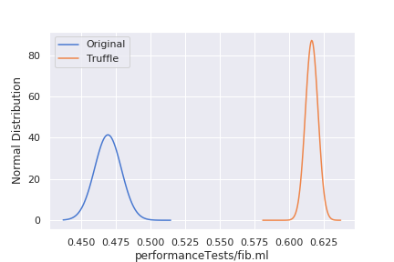
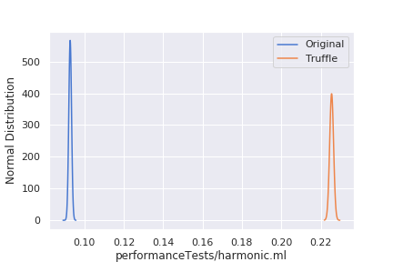

# Benchmarks

## Results

| Interpreter | Program | Score| Error| Units | Speedup |
|-------------|---------|------|------|-------|---------|
| Original | performanceTests/fib.ml | 0.469 | 0.019 | ops/s | - |
| Truffle | performanceTests/fib.ml | 0.616 | 0.009 | ops/s | 1.313 |
| Original | performanceTests/harmonic.ml | 0.093 | 0.001 | ops/s | - |
| Truffle | performanceTests/harmonic.ml | 0.226 | 0.002 | ops/s | 2.430 |


### Fib

### Harmonic


The details of the calculation are in a python notebook located [here](../notebooks/jmhv0.ipynb).

## Execution

Execution of the original Object Algebra implementation:

```bash
$ RESULT=original.json
$ JVM=/usr/lib/jvm/java-8-openjdk-amd64/bin/java
$ java -jar target/benchmarks.jar com.github.BenchmarkOriginal.testMethod -rf json -rff $RESULT -jvm $JVM
```

Execution of the Truffle implementation

```bash
$ RESULT=truffle.json
$ JVM=/home/manuel/jdk/graalvm-ee-1.0.0-rc16/bin/java
$ java -jar target/benchmarks.jar -jvmArgsAppend='-Dtruffle.class.path.append="$PWD/../language/target/language-1.0-SNAPSHOT-jar-with-dependencies.jar"' com.github.BenchmarkTruffle.testMethod -rf json -rff $RESULT -jvm $JVM
```

## Setup

The results presented above are executed on my laptop with no network connection (wifi, ethernet, bluetooth...) and as much services and software stopped as possible.
